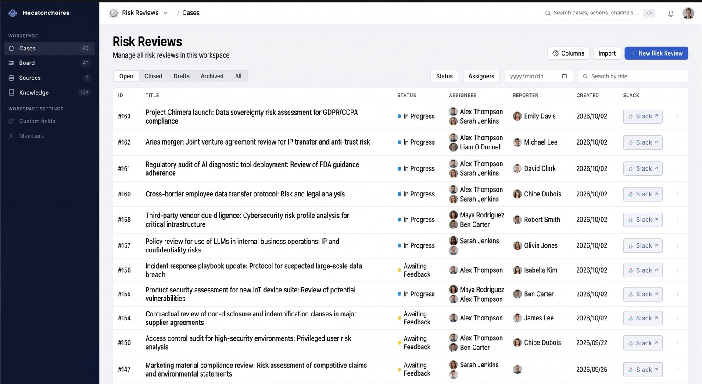
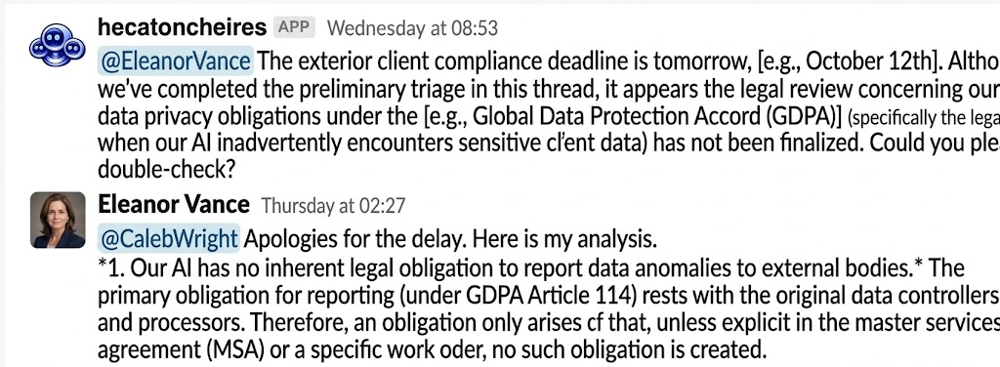

<p align="center">
  
</p>

<h1 align="center">Hecatoncheires</h1>

<p align="center">
  An AI-native case management platform that lives in Slack.
</p>

<p align="center">
  <a href="https://github.com/m-mizutani/hecatoncheires/actions/workflows/test.yml"></a>
  <a href="LICENSE"></a>
</p>



## What is Hecatoncheires

Hecatoncheires tracks **Cases** — risk reviews, security assessments, hiring
pipelines, or any other work item your team runs — inside **Workspaces** whose
fields you define in a TOML file. Every Case is tied to Slack, either as its own
channel or as a thread in a monitored channel, so the discussion stays where
your team already works. An AI agent answers mentions in those conversations:
it drafts new Cases, updates existing ones, and investigates using Slack,
Notion, GitHub, Jira, and the web. The same data is available through a Web UI
and a GraphQL API.

## Features

- **Configurable workspaces and fields** — define each workspace's custom fields
  (text, Markdown, number, select, user, date, URL, Case references), statuses,
  and Slack behavior in
  TOML. See [Configuration](docs/configuration.md).
- **Slack-native workflow** — create Cases with a slash command, ask the bot to
  draft one by mentioning it, and run each Case in its own channel or in a
  thread. See the [User Guide](docs/user_guide.md) and
  [Slack Integration](docs/slack.md).

  

- **AI agent with tools** — the agent reads Slack, Notion, GitHub, Jira, the
  web, and the workspace's Knowledge while it works on a Case. See
  [Agent Tools](docs/agent_tools.md).
- **Integrations** — connect [Notion](docs/integrations/notion.md),
  [GitHub](docs/integrations/github.md), and [Jira](docs/integrations/jira.md);
  each one is optional.
- **Agent Jobs** — run an agent on a schedule or when a Case is created or
  closed. See
  [Configuration → Job Definitions](docs/configuration.md#job-definitions-job)
  and [User Guide → Automation](docs/user_guide.md#automation-tied-to-the-case-lifecycle).
- **Knowledge** — record organization-specific knowledge (operating rules, past
  judgements, …) once, and let people and the agent find it again by semantic
  search.
  See [User Guide → Knowledge](docs/user_guide.md#knowledge).
- **Access control** — private Cases visible only to their Slack channel
  members, and a per-workspace Rego policy that decides who may use a
  workspace. See
  [Configuration → Authorization](docs/configuration.md#authorization-section-authz).
- **MCP endpoint** — a read-only Model Context Protocol server for AI clients,
  authorized by Rego. See [MCP Server](docs/mcp.md).
- **BigQuery export** — full-refresh each workspace's data into BigQuery for
  analysis. See [BigQuery Export](docs/export.md).
- **Eval harness** — run scenario files through the agent workflows offline and
  grade the results. See [Eval Harness](docs/eval.md).

## Requirements

To try it locally, nothing outside your machine is needed:

| Tool | Version |
|---|---|
| Go | 1.26.4+ (the `go` directive in `go.mod`) |
| Node.js | 22.22+ |
| pnpm | through Corepack (`corepack enable`) |

A production deployment runs on Google Cloud:

| Service | Purpose |
|---|---|
| Firestore | Primary data store |
| Cloud Storage | Agent session history and traces |
| LLM provider | OpenAI, Anthropic Claude (direct or on Vertex AI), or Google Gemini on Vertex AI |
| Gemini embeddings on Vertex AI | Required whenever the AI features are enabled, whichever LLM provider you use |
| Slack App | Sign-in, Case channels and threads, and the agent's conversations |

See [Deployment](docs/deployment.md) for the full setup.

## Quick Start

Run it locally with the in-memory backend and no Slack App:

```bash
git clone https://github.com/m-mizutani/hecatoncheires.git
cd hecatoncheires
corepack enable

# Build the Web UI, which is embedded into the Go binary
cd frontend
pnpm install --frozen-lockfile
pnpm run build
cd ..

go run . serve \
  --repository-backend=memory \
  --config=examples/config.toml \
  --no-auth=U000000000
```

Then open <http://localhost:8080>. Data is kept in memory and lost on restart.
[Getting Started](docs/getting_started.md) explains each step and how to run the
test suite.

## Deployment

Container images are published to the GitHub Container Registry for every
pushed commit, tagged with the full commit SHA. For example:

```bash
docker pull ghcr.io/m-mizutani/hecatoncheires:d57137a1a75c8bc5e3cae18354089fcb450f476a
```

[Deployment](docs/deployment.md) covers choosing an image, building your own,
and configuring Firestore, Cloud Storage, the LLM, and Slack.

## Documentation

| Document | Description |
|----------|-------------|
| [Documentation index](docs/README.md) | Reading paths by audience |
| [Concepts](docs/concepts.md) | Core concepts and glossary |
| [Getting Started](docs/getting_started.md) | Run locally in minutes |
| [Deployment](docs/deployment.md) | Production deployment overview |
| [Configuration](docs/configuration.md) | `config.toml` complete reference |
| [CLI Reference](docs/cli.md) | Subcommands, flags, and environment variables |
| [Slack Integration](docs/slack.md) | Slack App setup (OAuth, Events, Interactivity, Slash) |
| [Integrations](docs/integrations/README.md) | Notion, GitHub, and Jira |
| [Agent Tools](docs/agent_tools.md) | Tools the AI agent can call, and where each is available |
| [User Guide](docs/user_guide.md) | End-user workflows in Slack and the Web UI |
| [Operations](docs/operations.md) | Observability, runbook, backup |
| [MCP Server](docs/mcp.md) | Read-only MCP endpoint and its Rego authorization |
| [BigQuery Export](docs/export.md) | Exporting workspace data to BigQuery |
| [Eval Harness](docs/eval.md) | Offline scenario-based evaluation of LLM workflows |
| [Developing](docs/develop/README.md) | Architecture and contributor guide |

## Contributing

See [CONTRIBUTING.md](CONTRIBUTING.md) for the development environment, tests,
and the checks a pull request must pass.

## License

Hecatoncheires is licensed under the [Apache License 2.0](LICENSE).
